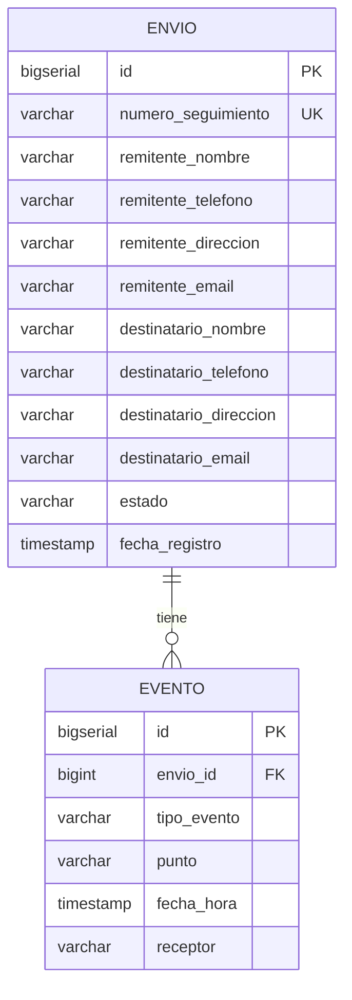

# tracking-logistico-database

Base de datos del sistema de tracking logístico — Fábrica Escuela, Sprint 1.
Monolito modular: un solo Postgres, dos módulos (`envios`, `eventos`) cada
uno en su propio schema, un solo usuario de aplicación (`app_user`). Cubre
HU-01 (registrar envío), HU-02 (registrar evento con receptor) y HU-03
(consultar estado de un envío).

## Modelo entidad-relación



Un envío tiene muchos eventos (`envio_id` en `eventos.evento` referencia a
`envios.envio.id`). FK directa entre schemas: al ser un monolito (un solo
proceso, un solo deploy) no hace falta réplica ni tabla puente — esa
complejidad solo se justifica si `envios` y `eventos` corrieran como
microservicios separados.

## Modelo lógico

**`envios.envio`** (HU-01, HU-03)

| Columna | Tipo | Restricciones |
|---|---|---|
| `id` | bigserial | **PK** |
| `numero_seguimiento` | varchar(30) | **UK**, not null |
| `remitente_nombre` | varchar(150) | not null |
| `remitente_telefono` | varchar(30) | not null |
| `remitente_direccion` | varchar(250) | not null |
| `remitente_email` | varchar(150) | |
| `destinatario_nombre` | varchar(150) | not null |
| `destinatario_telefono` | varchar(30) | not null |
| `destinatario_direccion` | varchar(250) | not null |
| `destinatario_email` | varchar(150) | |
| `estado` | varchar(30) | not null, `CHECK IN ('REGISTRADO','EN_TRANSITO','ENTREGADO')` |
| `fecha_registro` | timestamp | not null, default `now()` |

**`eventos.evento`** (HU-02)

| Columna | Tipo | Restricciones |
|---|---|---|
| `id` | bigserial | **PK** |
| `envio_id` | bigint | **FK →** `envios.envio(id)`, not null |
| `tipo_evento` | varchar(30) | not null, `CHECK IN ('RECOGIDO','EN_TRANSITO','EN_CENTRO_DISTRIBUCION','ENTREGADO')` |
| `punto` | varchar(150) | |
| `fecha_hora` | timestamp | not null, default `now()` |
| `receptor` | varchar(150) | `CHECK`: obligatorio si `tipo_evento = 'ENTREGADO'` |

## Normalización

Las dos tablas cumplen BCNF, no solo 3FN. La diferencia entre ambas formas normales solo importa cuando una tabla tiene dos o más claves candidatas que comparten atributos entre sí — ahí es donde 3FN permite una excepción que BCNF no permite. Acá no pasa eso:

- `envio` tiene dos claves candidatas (`id` y `numero_seguimiento`), pero no comparten ninguna columna, así que no hay excepción que aplicar.
- `evento` solo tiene una clave candidata (`id`), así que el caso ni siquiera se puede dar.

Por eso ambas están en BCNF directamente.

Sobre las columnas `remitente_*` / `destinatario_*` en `envio`: se dejaron planas en vez de sacarlas a una tabla `persona` aparte. No es un problema de normalización — sigue cumpliendo BCNF igual — es que ninguna HU de este sprint pide reutilizar contactos entre envíos distintos. Si esa necesidad aparece en otro sprint, ahí se normaliza.


## Modelo físico

[`schema.sql`](schema.sql) — script único con los dos schemas, las dos
tablas y el usuario `app_user`, ejecutable de punta a punta contra un
proyecto Postgres/Supabase vacío:

```bash
psql "$DATABASE_URL" -f schema.sql
```

Cambiar `CAMBIAR_POR_UNA_CONTRASENA_SEGURA` por una contraseña real antes de
correr contra un proyecto de verdad.

Por módulo, el mismo DDL vive separado en `ms-envios/01_schema_envios.sql` y
`ms-eventos/01_schema_eventos.sql` — útil si cada módulo se versiona aparte
más adelante; `schema.sql` es la unión de los dos, en orden.

## Preguntas de negocio

Ver [`preguntas.sql`](preguntas.sql) — 5 consultas contra `ms-envios`/
`ms-eventos`: envíos activos (filtro), remitente/destinatario de un envío
(filtro), conteo por estado (agregación), entregas por rango de fechas
(join + filtro), último evento por envío (join + `DISTINCT ON`).

## Consultas de referencia por módulo

`ms-envios/02_consultas_envios.sql` — 5 queries sobre `envios.envio` (buscar
por tracking, listar recientes, contar por estado, rango de fechas, buscar
por nombre).

## Estructura del repo

```
.
├── README.md
├── schema.sql
├── preguntas.sql
├── ms-envios/
│   ├── 01_schema_envios.sql
│   └── 02_consultas_envios.sql
└── ms-eventos/
    └── 01_schema_eventos.sql
```
