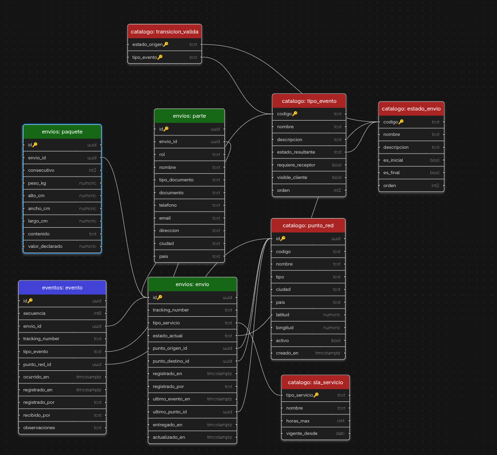

# Esquema SQL · Sistema de Tracking Logístico

Base de datos de los dos microservicios del Caso 6 (Fábrica Escuela 2026-2), tipo
FedEx, sobre Supabase/PostgreSQL. Cubre HU-01 a HU-07 del backlog.

## Esquema



Un solo Postgres, dos schemas con dueño explícito y un rol de base de datos por
servicio: `envios` (MS-Envíos) y `eventos` (MS-Eventos). Cada servicio replica
localmente el catálogo compartido — sin FKs ni vistas cruzando entre schemas — y
se sincronizan por un patrón outbox, no por acceso directo al otro schema.

## Migraciones

```
migrations/   8 migraciones, en orden de ejecución por su timestamp
```

| Migración | Contenido |
|---|---|
| `schemas_y_roles` | Schemas `envios`/`eventos`, roles `svc_envios`/`svc_eventos` |
| `envios_catalogo` | Réplica local del catálogo (estados, tipos de evento, transiciones) en `envios` |
| `envios_negocio` | Tablas de negocio de MS-Envíos: envío, parte, paquete |
| `eventos_referencia` | Réplica local del catálogo en `eventos` |
| `eventos_registro` | Tabla de eventos y máquina de estados de MS-Eventos |
| `vistas` | Vistas públicas de cada servicio |
| `permisos_y_aislamiento` | GRANT explícitos + RLS entre los dos roles de servicio |
| `procesos_externos` | Outbox y sincronización del catálogo entre servicios |

## Aplicar a Supabase

```bash
npm install -g supabase
supabase login
supabase link --project-ref <ref-del-proyecto>
supabase db push
```

Ajuste manual en el panel de Supabase: **API → Exposed schemas** debe dejar solo
`public` — los schemas `envios`/`eventos` no se publican por PostgREST, el
cliente entra por los microservicios.
