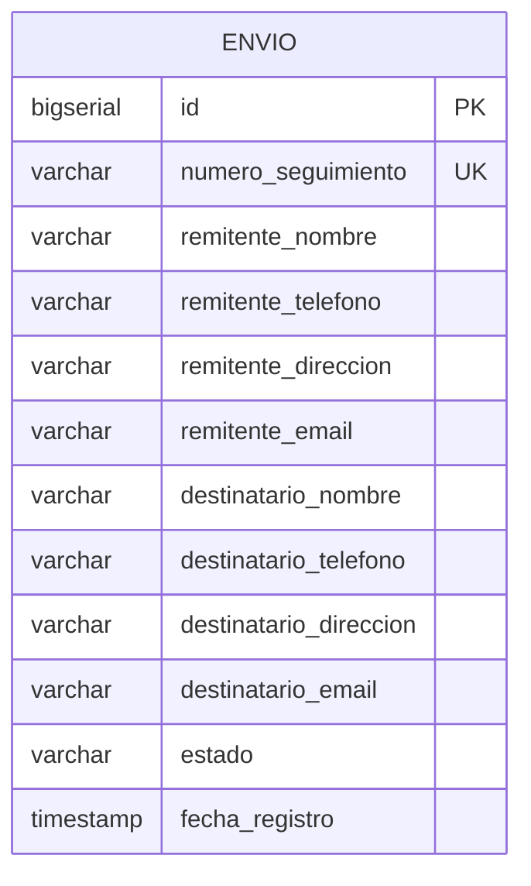

# tracking-logistico-database

Base de datos del sistema de tracking logístico, Fábrica Escuela — Sprint 1.
Dos microservicios, cada uno con su propio schema.

## `ms-envios` — schema `envios`

Cubre HU-01 (registrar un envío) y HU-03 (consultar estado de un envío).



Una sola tabla, `envios.envio`: remitente y destinatario van embebidos como
columnas (no hay tabla `parte` aparte). `numero_seguimiento` es único e
indexado — es la vía principal de consulta (HU-03). RLS desactivado a
propósito: el schema lo consume un backend con su propio usuario de base de
datos (`ms_envios_user`), no clientes finales autenticados directo.

| Archivo | Contenido |
|---|---|
| `ms-envios/01_schema_envios.sql` | `CREATE SCHEMA envios`, tabla `envio`, índice, usuario `ms_envios_user` con sus GRANT |
| `ms-envios/02_consultas_envios.sql` | 5 consultas de referencia: por tracking, más recientes, conteo por estado, rango de fechas, búsqueda por nombre |

```bash
psql "$DATABASE_URL" -f ms-envios/01_schema_envios.sql
```

Cambiar la contraseña de `ms_envios_user` en el archivo antes de correrlo —
`CAMBIAR_POR_UNA_CONTRASENA_SEGURA` es un placeholder, no un valor real.

## `ms-eventos` — schema `eventos`

Pendiente. Carpeta `ms-eventos/` creada, todavía vacía.

## Consultas de referencia

`preguntas.sql` en la raíz — 5 preguntas de negocio con su SQL, cruzando
ambos schemas (`envios`, `eventos`) una vez que `ms-eventos` exista.
